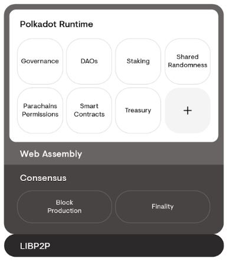
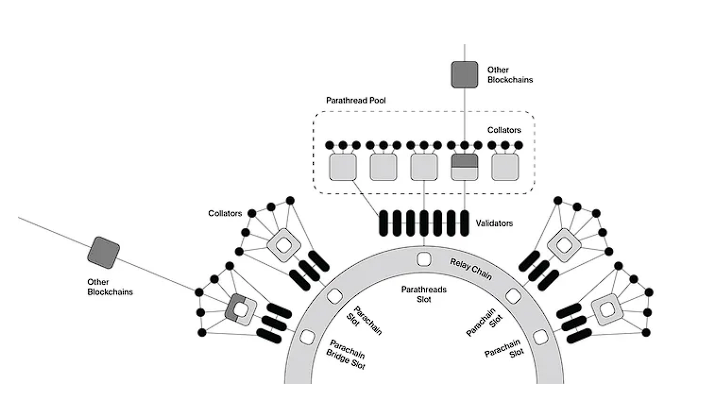
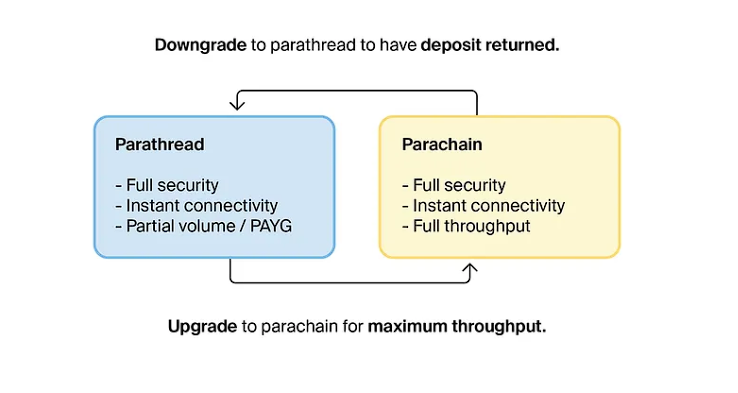
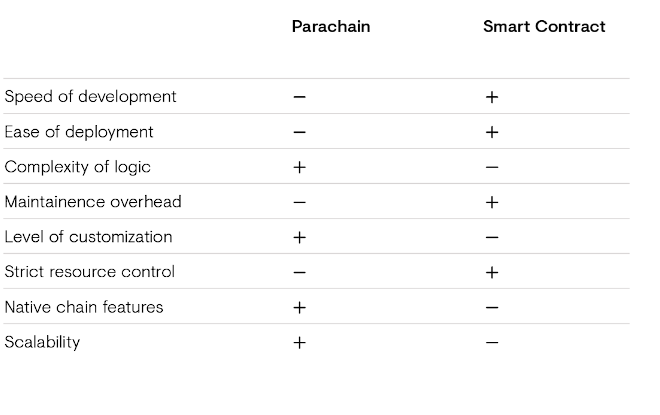

# What's the Difference of Building a Ethereum Smart Contract, Substrate Smart Contract, or choosing the Parachain & or Parathread?
I will attempt to contrast the development of a smart contract &amp; the development of a parachain/parathread.

## Our contenders

* Ethereum Smart Contracts: Ethereum is a blockchain platform that allows developers to build decentralized applications (dApps) using smart contracts. Smart contracts are self-executing programs that automatically enforce the rules and logic of an agreement between parties. Ethereum's smart contracts are written in Solidity and are executed on the Ethereum Virtual Machine (EVM).

* Substrate Smart Contracts: Substrate is a blockchain development framework that allows developers to build their own custom blockchains. It includes a modular architecture that allows developers to choose which components they want to include in their blockchain. Substrate smart contracts are written in the Rust programming language and are executed using the Ink! smart contract language.

* Parachains and Parathreads: Parachains and parathreads are components of the Polkadot network, which is a multi-chain network that allows for interoperability between different blockchains. Parachains are independent blockchains that are connected to the Polkadot network, while parathreads are lighter-weight blockchains that can run on the Polkadot network without requiring a full parachain slot. Parachains and parathreads can have their own smart contracts, written in any programming language that can be compiled to WebAssembly.

## Section Summary

* Ethereum smart contracts are executed on the Ethereum blockchain, while Substrate smart contracts are executed on custom blockchains built using the Substrate framework. Parachains and parathreads are components of the Polkadot network, which allows for interoperability between different blockchains and can run smart contracts in any language that can be compiled to WebAssembly.

### How do they differ in how they're constructed.

* Ethereum Smart Contracts: Ethereum smart contracts are constructed using the Solidity programming language. Solidity is a high-level language that is similar to JavaScript and is specifically designed for writing smart contracts. Once a smart contract is written, it is compiled into bytecode that can be executed on the Ethereum Virtual Machine (EVM), which is a sandboxed environment that allows the contract to be executed on the Ethereum network.

* Substrate Smart Contracts: Substrate smart contracts are constructed using the Ink! smart contract language, which is a Rust-based language specifically designed for writing smart contracts on the Substrate blockchain development framework. Ink! provides a high-level language that is easy to use and includes features such as automatic memory management, type safety, and built-in testing tools. Once a smart contract is written in Ink!, it is compiled into WebAssembly bytecode that can be executed on the Substrate runtime environment.

* Parachains and Parathreads: Parachains and parathreads are constructed using any programming language that can be compiled into WebAssembly bytecode. This includes languages such as Rust, C++, and AssemblyScript. Once a smart contract is written in one of these languages, it is compiled into WebAssembly bytecode and uploaded to the Polkadot network. The contract can then be executed on the Polkadot network using the WebAssembly runtime environment.

Images/Substrate/Parachain/downgrade_upgrade.png

## Section Summary
* Ethereum smart contracts are constructed using the Solidity programming language and are executed on the Ethereum Virtual Machine. Substrate smart contracts are constructed using the Ink! smart contract language and are executed on the Substrate runtime environment. Parachains and parathreads can be constructed using any programming language that can be compiled into WebAssembly bytecode and are executed on the WebAssembly runtime environment on the Polkadot network.

- Below you'll find a side by side comparison of the benefits and drawbacks of developing substrate based smart contract and parachains.

# Discoveries from experiment
Overall, the choice between developing a smart contract or a parachain will depend on the specific use case and requirements of the project. Smart contracts are more suitable for simple use cases and limited budgets, while parachains are better suited for more complex use cases with greater customization needs and larger budgets. Understanding the financial implications of using these technologies can help inform key business decisions, such as technology stack selection, development timelines, and revenue potential.

* Cost of Development: The cost of developing a product using Ethereum smart contracts, Substrate smart contracts, or parachains/parathreads can vary depending on the complexity of the project, the size of the development team, and the chosen technology stack. Solidity is a well-established language and has a large developer community, making it potentially easier to find developers and resources. In contrast, Substrate and parachains/parathreads are newer technologies and may require a more specialized skillset, which could potentially lead to higher development costs.

* Cost of Deployment: Ethereum smart contracts are executed on the Ethereum network, which requires gas fees to be paid in ether (ETH) for each transaction. These gas fees can be highly volatile and may increase during periods of high network congestion, leading to increased costs for deploying and executing smart contracts. Substrate smart contracts and parachains/parathreads can be deployed on other networks, such as Polkadot, which may have lower transaction fees.

* Revenue Generation: The choice of technology can impact the potential revenue generation of the product. Ethereum smart contracts are well-suited for decentralized applications that require a high degree of trustlessness, such as decentralized finance (DeFi) applications. Substrate smart contracts and parachains/parathreads may be more suited for use cases that require greater customization and interoperability between different blockchains.

* Time to Market: The time to market for a product can be impacted by the choice of technology. Ethereum smart contracts have a more established ecosystem, making it potentially easier and faster to develop and deploy a product. Substrate smart contracts and parachains/parathreads may require more time to develop and test, especially if the development team is less experienced with the technology.

# Pitfalls & Pain Points

* Some pain points we discovered during our development process of the ethereum Art_Registry smart contract were whether to optimize for gas fees while maintaining a user friendly that could be easily read.

* Some Pitfalls we discovered during our development of the substrate pallet Art_Registry were that the complexity and fore thought it took, combine with understanding of infrastructure requirements were a hefty order for a team of web3 developers let alone a single developer.

### Disclaimer: 
All code pertaining to substrate based parachains, parathreads were intended for reference of what is both possible and is not an endorsement of any particular software.

### Links to Sources.

Builder's Starter Guide - https://guide.kusama.network/docs/build-build-with-polkadot

Collator - https://guide.kusama.network/docs/learn-collator

Polkadot GitHub - https://github.com/paritytech/polkadot

Connect A Realy and Parachain (Tutorial) - https://docs.substrate.io/tutorials/connect-relay-and-parachains/prepare-a-local-relay-chain/

Pay as You Go (Parathread Explaination) - https://medium.com/polkadot-network/parathreads-pay-as-you-go-parachains-7440d23dde06
